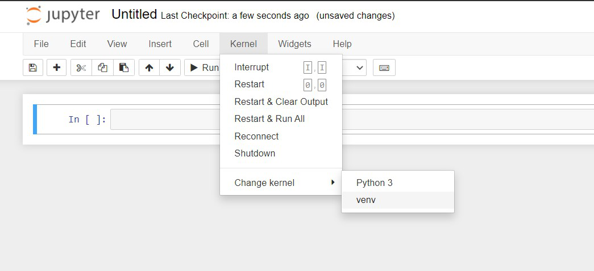

# Credit scoring classifier ("Construisez un modèle de scoring")

[This project is part of the AI Engineer cursus on OpenClassrooms]

We are provided with a dataset from [Home](https://s3-eu-west-1.amazonaws.com/static.oc-static.com/prod/courses/files/Parcours_data_scientist/Projet+-+Impl%C3%A9menter+un+mod%C3%A8le+de+scoring/Projet+Mise+en+prod+-+home-credit-default-risk.zip) which lists 307.511 records. 

There are 220 columns dispatched accross 7 datasets:


> The goal is to build a classifier that can predict of the credit request should be accepted or rejected.
> However, given the nature of the project, we also need to be able to explain the model overall and a given result individually.

1. At first, we will conduce and EDA (01_EDA.ipynb)
2. Then we will test several models to find those that best work with the dataset (02_Spot_checking_models.ipynb)
3. After that, we will apply various methods to improve the selected models (03_Scoring.ipynb)
4. Finally, we will tray to explain the model globally and locally (03_Scoring.ipynb)

## Running the notebook online

As the notebooks use hyperlinks for the navigation, and because this doesn't work on GitHub, they are also avaible on [nbviewer.org](https://nbviewer.org/github/Valkea/OC_AI_04/tree/main/) for convenience.

## Running the notebook locally

In order to use this project locally, you will need to have Python and Jupyter notebook installed.
Once done, we can set the environment by using the following commands:

### First, 
let's duplicate the project github repository

```bash
>>> git clone https://github.com/Valkea/OC_AI_04
>>> cd OC_AI_04
```

### Secondly,
let's download the [dataset](https://s3-eu-west-1.amazonaws.com/static.oc-static.com/prod/courses/files/Parcours_data_scientist/Projet+-+Impl%C3%A9menter+un+mod%C3%A8le+de+scoring/Projet+Mise+en+prod+-+home-credit-default-risk.zip) and put it in the data folder.

```bash
>>> wget https://s3-eu-west-1.amazonaws.com/static.oc-static.com/prod/courses/files/Parcours_data_scientist/Projet+-+Impl%C3%A9menter+un+mod%C3%A8le+de+scoring/Projet+Mise+en+prod+-+home-credit-default-risk.zip -P data
```

### Thirdly,
let's create a virtual environment and install the required Python libraries

(Linux or Mac)
```bash
>>> python3 -m venv venvP4
>>> source venvP4/bin/activate
>>> pip install -r requirements.txt
```

(Windows):
```bash
>>> py -m venv venvP4
>>> .\venvP4\Scripts\activate
>>> py -m pip install -r requirements.txt
```

### Finally,
let's configure and run the virtual environment for Jupyter notebook


#### Install jupyter kernel for the virtual environment using the following command:

```bash
>>> pip install ipykernel
>>> python -m ipykernel install --user --name=venvP4
```

#### Select the installed kernel

In order to run the various notebooks, you will need to use the virtual environnement created above.
So once the notebooks are opened (see below), prior to running it, follow this step:


#### Run the jupyter notebooks

1. in order to see the interactive EDA, run:
```bash
>>> voila 01_EDA.ipynb
```

2. to see the spot checking of the models, use the following command:
```bash
>>> jupyter notebook 02_Spot_checking_models.ipynb 
```

3. then to explore the various methods used to improve the selected models, or the `Shap` explanations:
```bash
>>> jupyter notebook 03_Scoring.ipynb 
```

4. finally, in order to get all the scores at the same place with various graphics and tables use:
```bash
>>> jupyter notebook Display_Scores.ipynb 
```

#### Uninstalling the venv kernel
Once done with the project, the kernel can be listed and removed using the following commands:

```bash
>>> jupyter kernelspec list
>>> jupyter kernelspec uninstall venvP4
```

